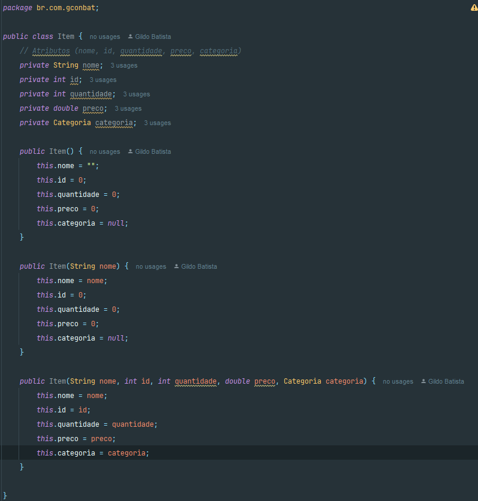
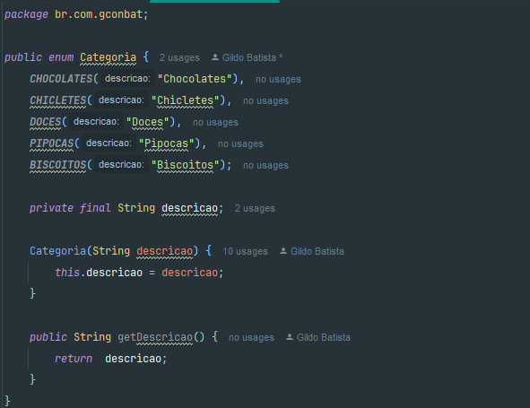
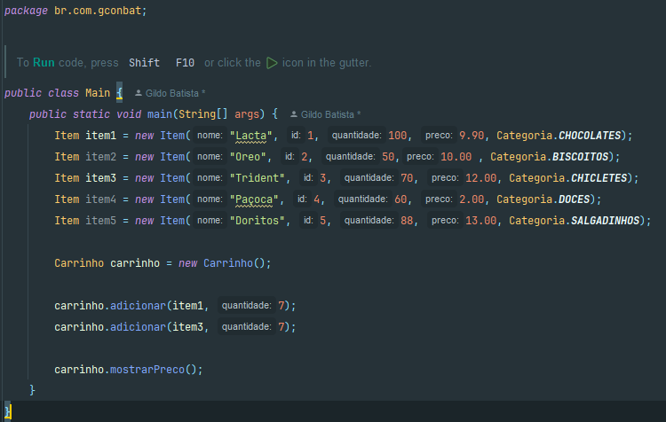
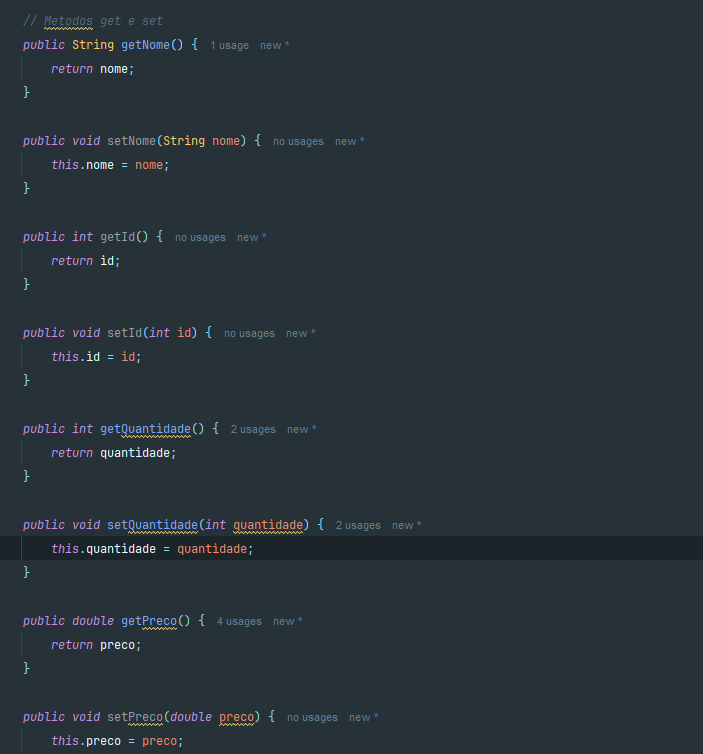
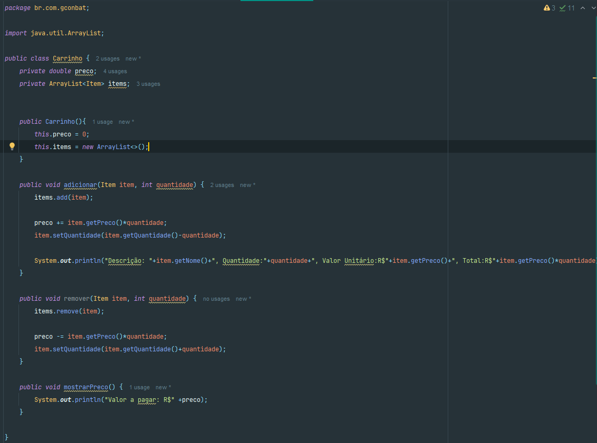

### *Sistema Bomboniere*

Com base no inicio do projeto, foi criado a classe (Item) e os (construtores).

Criado classe (Categoria) com os atributos do projeto Bomboniere.

No método main criado os intens por categoria.

Na classe Item foram estruturados os métodos Get e Set e toString.

Criado a classe Carrinho, e adicionado o metodo de adicionar.
